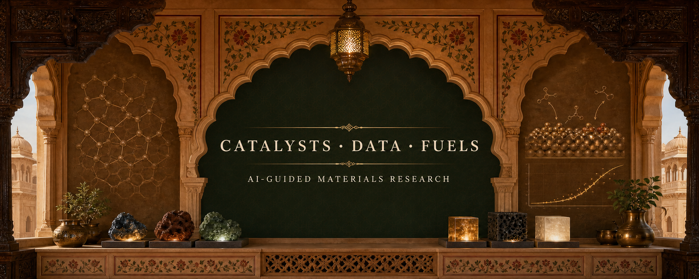

  

### A research dashboard for catalysts, data & cleaner fuels

PhD researcher in **Materials Science & Engineering at Nanyang Technological University** 
Designing AI-guided catalysts where experiments, materials informatics, and probabilistic learning meet.

`CO₂ → FUELS` · `BAYESIAN OPTIMISATION` · `MATERIALS INFORMATICS` · `EXPERIMENTAL CATALYSIS`

◆ ───────────── ✦ ───────────── ◆

## The dashboard

<table>
  <tr>
    <td width="50%" valign="top">
      <h3>◈ Now</h3>
      
<strong>Singapore · PhD research</strong>

      
Connecting catalyst synthesis and reactor evidence with uncertainty-aware learning.

    </td>
    <td width="50%" valign="top">
      <h3>✦ North star</h3>
      
<strong>Every experiment should sharpen the next.</strong>

      
Models guide the search; mechanisms and physical evidence keep it honest.

    </td>
  </tr>
</table>

<table>
  <tr>
    <td align="center"><strong>3</strong> RESEARCH ENVIRONMENTS</td>
    <td align="center"><strong>CO₂ → FUELS</strong> APPLICATION</td>
    <td align="center"><strong>BAYESIAN</strong> SEARCH STRATEGY</td>
    <td align="center"><strong>EXPERIMENT + AI</strong> WORKING LANGUAGE</td>
  </tr>
</table>

## Three rooms of research

<table>
  <tr>
    <td width="33%" valign="top">
      <h3>🏛️ Catalysts</h3>
      
Direct Joule synthesis, Fe-based catalyst reconstruction, oxide–carbide interfaces, and CO₂ hydrogenation.

      SYNTHESIS · STRUCTURE · MECHANISM
    </td>
    <td width="33%" valign="top">
      <h3>📐 Data</h3>
      
Multi-task Gaussian processes, Bayesian optimisation, materials descriptors, and uncertainty-aware experiments.

      MODELS · UNCERTAINTY · DECISIONS
    </td>
    <td width="33%" valign="top">
      <h3>✦ Fuels</h3>
      
Turning CO₂ into gasoline- and jet-fuel-range hydrocarbons through mechanism-informed catalyst design.

      CARBON · CONVERSION · CLEANER FLIGHT
    </td>
  </tr>
</table>

## Featured doors

<table>
  <tr>
    <td width="50%" valign="top">
      <h3>🪷 <a href="https://somyaverma2001.github.io/somya-verma-research-portfolio/">Research portfolio →</a></h3>
      
A visual record of my work across AI-guided catalysis, CO₂ conversion, high-entropy alloys, and cleaner-flight fuel pathways.

      
<code>PROJECTS</code> <code>PUBLICATIONS</code> <code>RESEARCH STORY</code>

    </td>
    <td width="50%" valign="top">
      <h3>📜 <a href="https://www.sciencedirect.com/science/article/pii/S2352492825016241">Featured publication →</a></h3>
      
<em>Enhanced modeling of electronic structure–mechanical property relationships</em> — DOS-informed, data-driven analysis of high-entropy alloys.

      
<code>HEAs</code> <code>ELECTRONIC STRUCTURE</code> <code>ML</code>

    </td>
  </tr>
</table>

## Research courtyard

<table>
  <tr>
    <td width="33%" valign="top">
      <strong>AxCIS Lab</strong> 
      UC BERKELEY / BEARS
      
AI for exploration of catalyst inorganic surfaces.

    </td>
    <td width="33%" valign="top">
      <strong>Accelerated Catalyst Development Platform</strong> 
      A*STAR ISCE²
      
High-throughput and data-guided catalyst development.

    </td>
    <td width="33%" valign="top">
      <strong>HIP Lab</strong> 
      NTU SINGAPORE
      
Catalysis, materials, and process–structure relationships.

    </td>
  </tr>
</table>

## Side quests

<table>
  <tr>
    <td width="33%" valign="top">
      <strong>🧘 <a href="https://somyaverma2001.github.io/form30-workout-assistant/">Somsy</a></strong>
      
A hands-free, 30-day private movement ritual.

    </td>
    <td width="33%" valign="top">
      <strong>📚 <a href="https://somyaverma2001.github.io/cat-prep-hub/">CAT Prep Hub</a></strong>
      
An offline study system with persistent practice progress.

    </td>
    <td width="33%" valign="top">
      <strong>🃏 <a href="https://github.com/SomyaVerma2001/Uno---No-Mercy">UNO — No Mercy</a></strong>
      
A playful card-game side build.

    </td>
  </tr>
</table>

◆ ───────────── ✦ ───────────── ◆

<em>Experimental evidence first. Models with humility. Cleaner trajectories ahead.</em>

